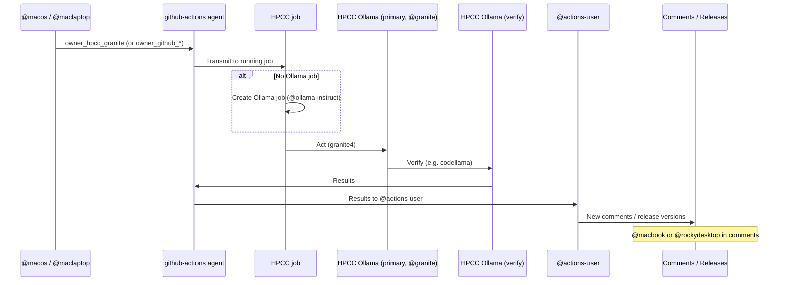

# LangFlow state diagram – 20 context keys end-to-end flow

Mermaid diagrams for the full pipeline: **origin (macOS or Rocky Linux) → github-actions → HPCC job → Ollama job (create if needed) → HPCC Ollama model → verification by second Ollama model → results → GitHub Actions → @actions-user → comments/releases with @macbook or @rockydesktop**.

## Main flow (all 20 keys) – decision at each node: choose one of 20 keys

At every node, the decision process is: **choose which one of the 20 keys** applies; the key is then used for the next step.

```mermaid
flowchart TB
    subgraph KEYLIST["20 keys (reference)"]
        direction LR
        K01["1 owner_hpcc_granite"]
        K02["2 owner_hpcc_deepseek"]
        K03["3 owner_hpcc_qwen"]
        K04["4 owner_hpcc_codellama"]
        K05["5 owner_github_granite"]
        K06["6 owner_github_deepseek"]
        K07["7 owner_github_qwen"]
        K08["8 owner_github_codellama"]
        K09["9 hpcc_github_granite"]
        K10["10 hpcc_github_deepseek"]
        K11["11 hpcc_github_qwen"]
        K12["12 hpcc_github_codellama"]
        K13["13 quay_hpcc_granite"]
        K14["14 quay_hpcc_deepseek"]
        K15["15 quay_hpcc_qwen"]
        K16["16 quay_hpcc_codellama"]
        K17["17 quay_github_granite"]
        K18["18 quay_github_deepseek"]
        K19["19 quay_github_qwen"]
        K20["20 quay_github_codellama"]
    end

    N0["Node 0: Entry payload"]
    D0{"Decision: which key?\nChoose 1 of 20"}
    N1["Node 1: github-actions receives"]
    D1{"Decision: which key?\nChoose 1 of 20"}
    N2["Node 2: Transmit to HPCC running job"]
    D2{"Decision: which key?\nChoose 1 of 20"}
    N3["Node 3: Ollama job running?\n(per key 1..20)"]
    D3{"Decision: which key?\nChoose 1 of 20\n+ job exists?"}
    N4A["Node 4a: Create Ollama job\n@ollama-instruct\n(key 1..20)"]
    N4B["Node 4b: Use existing job\n(key 1..20)"]
    D4{"Decision: which key?\nChoose 1 of 20"}
    N5["Node 5: HPCC Ollama model acts\n(primary; key 1..20)"]
    D5{"Decision: which key?\nChoose 1 of 20\n→ primary model"}
    N6G["key 1,5,9,13,17: @granite"]
    N6D["key 2,6,10,14,18: @deepseek"]
    N6Q["key 3,7,11,15,19: @qwen"]
    N6C["key 4,8,12,16,20: @codellama"]
    D6{"Decision: which key?\nChoose 1 of 20\n→ verify model"}
    N7["Node 7: HPCC Ollama verifies\n(secondary)"]
    D7{"Decision: which key?\nChoose 1 of 20"}
    N8["Node 8: Results"]
    D8{"Decision: which key?\nChoose 1 of 20"}
    N9["Node 9: Results → GitHub Actions user"]
    D9{"Decision: which key?\nChoose 1 of 20"}
    N10["Node 10: @actions-user acts"]
    D10{"Decision: which key?\nChoose 1 of 20\n→ comment target"}
    N11A["keys 1-8,9-12: @macbook\nin comments"]
    N11B["keys 13-20: @rockydesktop\nin comments"]

    N0 --> D0
    D0 -->|key 1..20| N1
    N1 --> D1
    D1 -->|key 1..20| N2
    N2 --> D2
    D2 -->|key 1..20| N3
    N3 --> D3
    D3 -->|key 1..20, no job| N4A
    D3 -->|key 1..20, job exists| N4B
    N4A --> D4
    N4B --> D4
    D4 -->|key 1..20| N5
    N5 --> D5
    D5 -->|granite| N6G
    D5 -->|deepseek| N6D
    D5 -->|qwen| N6Q
    D5 -->|codellama| N6C
    N6G --> D6
    N6D --> D6
    N6Q --> D6
    N6C --> D6
    D6 -->|key 1..20| N7
    N7 --> D7
    D7 -->|key 1..20| N8
    N8 --> D8
    D8 -->|key 1..20| N9
    N9 --> D9
    D9 -->|key 1..20| N10
    N10 --> D10
    D10 -->|owner_* or hpcc_*| N11A
    D10 -->|quay_*| N11B
```

**Decision at each node (choose one of 20 keys):**

| Node | Action | Decision process: choose one of 20 keys |
|------|--------|----------------------------------------|
| 0 | Entry payload | **Decision:** Which key (1–20)? Validate key ∈ {owner_hpcc_granite, …, quay_github_codellama}. |
| 1 | github-actions receives | **Decision:** Which key (1–20)? Key identifies sender (owner / quay / hpcc) and receiver (hpcc / github). |
| 2 | Transmit to HPCC job | **Decision:** Which key (1–20)? All 20 → transmit; key determines which HPCC job/env. |
| 3 | Ollama job running? | **Decision:** Which key (1–20)? Key’s model suffix → check if that Ollama job exists for this key. |
| 4a/4b | Create or use job | **Decision:** Which key (1–20)? Key → which model (granite/deepseek/qwen/codellama) to create or use. |
| 5 | HPCC Ollama acts (primary) | **Decision:** Which key (1–20)? Key → **choose one of 20** → route to @granite (keys 1,5,9,13,17), @deepseek (2,6,10,14,18), @qwen (3,7,11,15,19), @codellama (4,8,12,16,20). |
| 6 | Verify model | **Decision:** Which key (1–20)? Key → choose secondary model for verification (one of 20 keys fixes primary; verify step picks another model). |
| 7 | HPCC Ollama verifies | **Decision:** Which key (1–20)? Key tags the result for the rest of the pipeline. |
| 8 | Results | **Decision:** Which key (1–20)? Key tags results for routing. |
| 9 | Results → GitHub Actions user | **Decision:** Which key (1–20)? All 20 → GA user; key in payload. |
| 10 | @actions-user acts | **Decision:** Which key (1–20)? Key → which follow-up (comment/release). |
| 11 | New comments & releases | **Decision:** Which key (1–20)? **Choose one of 20:** keys 1–8 or 9–12 → @macbook in comments; keys 13–20 → @rockydesktop in comments. |

**Each node chooses one of the 20 keys — mapping:**

| Key # | Key name | Node 5 (primary model) | Node 11 (comment target) |
|-------|----------|------------------------|--------------------------|
| 1 | owner_hpcc_granite | @granite | @macbook |
| 2 | owner_hpcc_deepseek | @deepseek | @macbook |
| 3 | owner_hpcc_qwen | @qwen | @macbook |
| 4 | owner_hpcc_codellama | @codellama | @macbook |
| 5 | owner_github_granite | @granite | @macbook |
| 6 | owner_github_deepseek | @deepseek | @macbook |
| 7 | owner_github_qwen | @qwen | @macbook |
| 8 | owner_github_codellama | @codellama | @macbook |
| 9 | hpcc_github_granite | @granite | @macbook |
| 10 | hpcc_github_deepseek | @deepseek | @macbook |
| 11 | hpcc_github_qwen | @qwen | @macbook |
| 12 | hpcc_github_codellama | @codellama | @macbook |
| 13 | quay_hpcc_granite | @granite | @rockydesktop |
| 14 | quay_hpcc_deepseek | @deepseek | @rockydesktop |
| 15 | quay_hpcc_qwen | @qwen | @rockydesktop |
| 16 | quay_hpcc_codellama | @codellama | @rockydesktop |
| 17 | quay_github_granite | @granite | @rockydesktop |
| 18 | quay_github_deepseek | @deepseek | @rockydesktop |
| 19 | quay_github_qwen | @qwen | @rockydesktop |
| 20 | quay_github_codellama | @codellama | @rockydesktop |

## State diagram (20 keys as states)

```mermaid
stateDiagram-v2
    direction LR
    [*] --> Origin

    state Origin {
        [*] --> macOS
        [*] --> Rocky
        state macOS {
            owner_hpcc_granite
            owner_hpcc_deepseek
            owner_hpcc_qwen
            owner_hpcc_codellama
            owner_github_granite
            owner_github_deepseek
            owner_github_qwen
            owner_github_codellama
        }
        state Rocky {
            quay_hpcc_granite
            quay_hpcc_deepseek
            quay_hpcc_qwen
            quay_hpcc_codellama
            quay_github_granite
            quay_github_deepseek
            quay_github_qwen
            quay_github_codellama
        }
        state HPCC_origin {
            hpcc_github_granite
            hpcc_github_deepseek
            hpcc_github_qwen
            hpcc_github_codellama
        }
    }

    Origin --> github_actions_receives
    github_actions_receives --> HPCC_job
    HPCC_job --> Ollama_job_check
    Ollama_job_check --> Create_ollama_job : if not running
    Ollama_job_check --> Ollama_primary : if running
    Create_ollama_job --> Ollama_primary
    Ollama_primary --> Ollama_verify
    Ollama_verify --> Results
    Results --> GitHub_actions_user
    GitHub_actions_user --> actions_user_acts
    actions_user_acts --> Comments_releases
    Comments_releases --> [*]

    state Comments_releases {
        [*] --> with_macbook
        [*] --> with_rockydesktop
    }
```

## Sequence (one key example: owner_hpcc_granite)

## Git hooks and @macbook / @rockydesktop

When **fetch_and_merge** runs (e.g. in `daily-github-sync.sh`), a **post-merge** hook runs after `git merge`. If any merged commit message contains **@macbook** or **@rockydesktop**, the hook can trigger local actions (e.g. notify, run a script). See **.githooks/** and **docs/GIT_HOOKS.md**.
